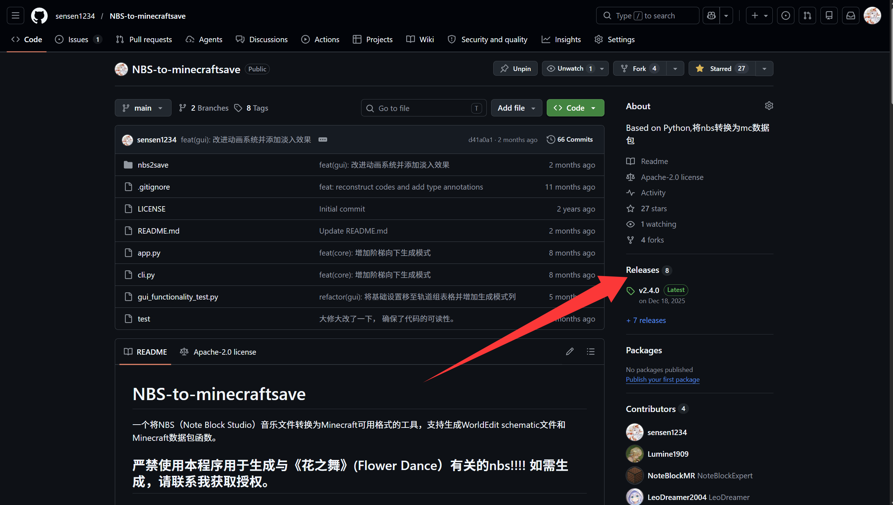
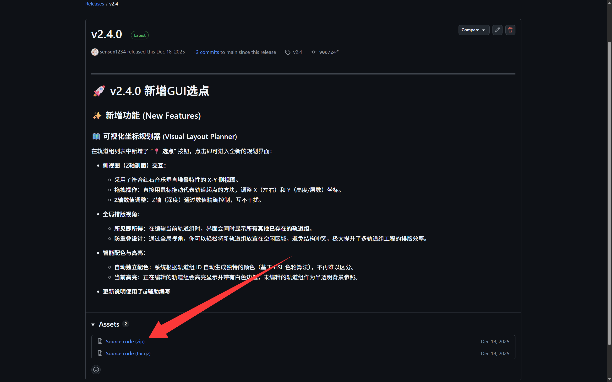
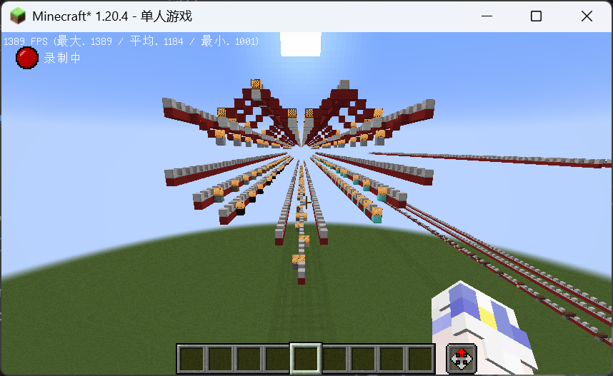
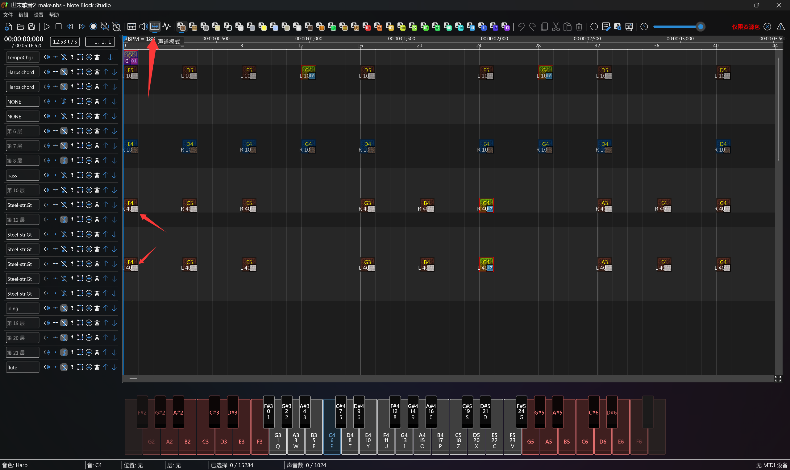
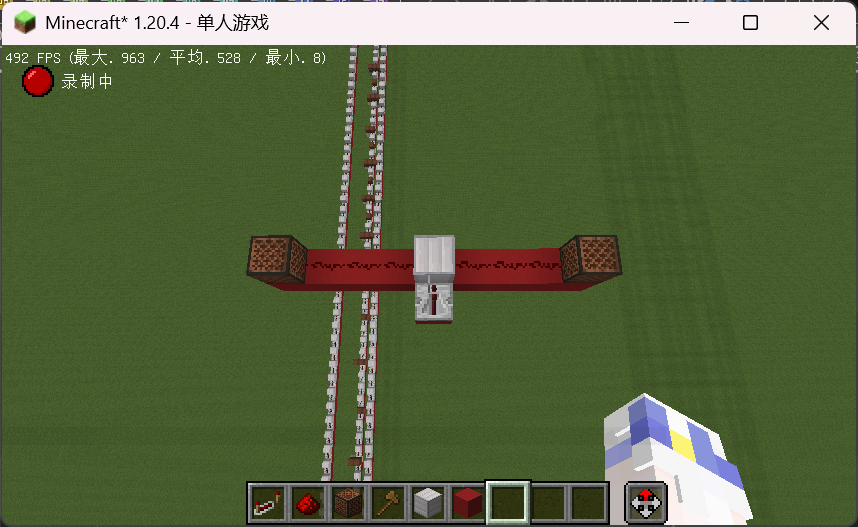
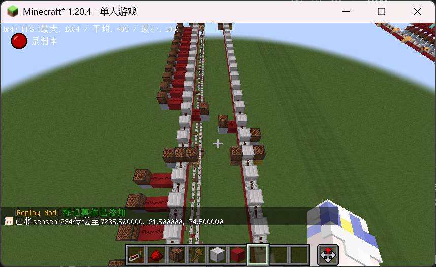
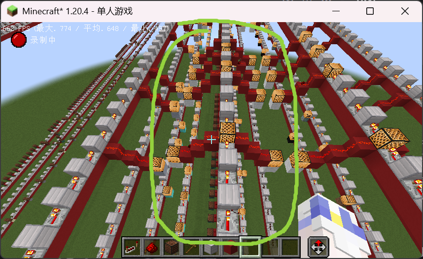

# NBS-to-Minecraftsave 完整使用指南

> **NBS-to-Minecraftsave** 是一款强大的转换工具，可将 Note Block Studio 制作的音乐文件 (`.nbs`) 转换为 Minecraft 中可播放的格式。

---

## 一、环境准备

### 1.1 系统要求

| 项目               | 要求                                                      |
| :----------------- | :-------------------------------------------------------- |
| **操作系统**       | Windows 10/11、macOS、Linux 均可 (只要能运行 python 就行) |
| **Python 版本**    | Python 3.8 及以上版本                                     |
| **Minecraft 版本** | Java Edition 1.13 至 26.1.1                               |

### 1.2 必要软件安装

#### 步骤 1：安装 Python

1. 访问 [Python 官网](https://www.python.org/downloads/)
2. 下载 Python 3.8 或更高版本
3. 安装时**务必勾选 "Add Python to PATH"**(添加到环境变量)
4. 打开命令提示符 (PowerShell)，输入以下命令验证安装：

   ```sh
   python --version
   ```

   **若成功安装，应显示版本号**：

   ```ansi
   Python 3.x.x
   ```

#### 步骤 2：安装 Git(可选)

> 💡 仅在需要通过 Git 克隆仓库时安装

1. 访问 [Git 官网](https://git-scm.com/download/win)
2. 下载并安装 Git
3. 安装完成后验证：

   ```sh
   git --version
   ```

---

## 二、下载与安装

### 2.1 方式一：通过 Git 克隆 (推荐)

打开 PowerShell，运行以下命令：

```sh
# 克隆仓库到本地
git clone https://github.com/sensen1234/NBS-to-minecraftsave.git

# 进入项目目录
cd NBS-to-minecraftsave
```

### 2.2 方式二：手动下载

1. 访问项目 GitHub 页面 (<https://github.com/sensen1234/NBS-to-minecraftsave>)
2. 点击 Releases
   
3. 找到最新版，点击 Assets 里面的 Source code 进行下载
   
4. 解压下载的文件到任意任意目录 (尽量为英文目录)

### 2.3 安装依赖

程序需要以下 Python 库：

| 库名称        | 版本要求   | 作用描述                |
| :------------ | :--------- | :---------------------- |
| `pynbs`       | 最新稳定版 | 读取和解析 NBS 文件格式 |
| `mcschematic` | 最新稳定版 | 生成 Minecraft 结构文件 |
| `PyQt6`       | 最新稳定版 | 提供图形用户界面框架    |

进入项目目录后，运行以下命令安装所有依赖：

```sh
uv sync
```

> 💡 **Tips**：如果下载速度慢，可以使用国内镜像源：
>
> ```sh
> uv sync -i https://pypi.tuna.tsinghua.edu.cn/simple
> ```

### 2.4 验证安装

运行以下命令验证安装是否成功：\
(需要在项目目录下运行)

```sh
# 测试 GUI 模式
uv run src/app.py

# 或测试 CLI 模式
uv run src/cli.py
```

---

## 三、配置说明

> 程序支持两种使用方式：**GUI 图形界面**(推荐新手) 和 **CLI 命令行**(适合高级用户和自动化脚本)。

### 3.1 GUI 模式配置

#### 启动 GUI

```sh
uv run src/app.py
```

#### 界面结构

程序界面分为三个主要标签页：

| 标签页       | 图标 | 功能说明                         |
| :----------- | :--- | :------------------------------- |
| **基础设置** | ⚙️   | 文件输入输出、版本选择、格式配置 |
| **轨道组**   | 🛤️   | 轨道分组管理、坐标规划、方块配置 |
| **运行日志** | 📝   | 实时显示转换进度和错误信息       |

---

#### 基础设置详解

| 配置项           | 说明                             | 操作方式                           |
| :--------------- | :------------------------------- | :--------------------------------- |
| **文件输入**     | 选择要转换的 `.nbs` 文件         | 点击"浏览..."按钮选择文件          |
| **输出路径**     | 设置生成文件的保存路径           | 自动根据输入文件名填充，可手动修改 |
| **目标游戏版本** | 选择 Minecraft Java Edition 版本 | 从下拉菜单选择对应版本             |
| **输出格式**     | 选择生成文件类型                 | 二选一：Schem 或 Mcfunction        |

**输出格式对比**：

| 格式                | 文件扩展名    | 依赖模组            | 适用场景             |
| :------------------ | :------------ | :------------------ | :------------------- |
| WorldEdit Schematic | `.schem`      | 需要 WorldEdit      | 快速导入、可视化编辑 |
| Minecraft Function  | `.mcfunction` | 无需模组 (原版支持) | 原版部署             |

---

#### 轨道组配置详解

> ⭐ **这是程序最核心的配置区域**，用于管理音符轨道的空间布局。

**表格列说明**：

| 列名         | 说明                                    | 示例值                   |
| :----------- | :-------------------------------------- | :----------------------- |
| **ID**       | 轨道组唯一标识符                        | `0`, `1`, `2`...         |
| **基准 X**   | 该组在 Minecraft 世界中的 X 坐标        | `0`, `100`, `-50`...     |
| **基准 Y**   | 该组在 Minecraft 世界中的 Y 坐标 (高度) | `64`, `100`...           |
| **基准 Z**   | 该组在 Minecraft 世界中的 Z 坐标        | `0`, `200`...            |
| **坐标规划** | 打开可视化坐标选择器                    | 点击 📍 选点 按钮        |
| **轨道 ID**  | NBS 文件中的轨道编号 (多个用逗号分隔)   | `0,1,2,3,4,5,6`          |
| **基础方块** | 构成平台的主体方块类型                  | `minecraft:iron_block`   |
| **覆盖方块** | 覆盖在平台顶层的方块                    | `minecraft:iron_block`   |
| **生成模式** | 生成结构的样式                          | `default` 或 `staircase` |

#### 详细说明

- ID：

  每个 ID 对应一个`轨道组`，如 0 对应第一个轨道组，2 对应第二个，以此类推  

  通常不需要修改该数值

- 基准 X、Y、Z：

  每个轨道组的**第一个方块 (cover 或音符盒)**在 Minecraft 世界中的坐标，用于确定音符平台和红石线的位置。
  - 若选择的为 schem 模式，**该处对应的为相对于 (0,0,0) 坐标的向量位置**

    如：基准X=100,基准Y=64,基准Z=0 表示轨道组的**第一个方块(cover或音符盒)**在(100,64,0)位置生成  
    其中(0,0,0)为Schematic文件的原点，与Minecraft世界原点不同(也就是你站在地上，输入schem load对应的那个坐标)  
    推荐0轨道(ID=0)设定为voice(Main Rhythm)轨道，其轨道的坐标设置为(0,0,0)

  - 若选择的为 mcfunction 模式，**该处对应的为 Minecraft 中的坐标**
    如：基准 X=100，基准 Y=64，基准 Z=0 表示轨道组的**第一个方块 (cover 或音符盒)**在 (100,64,0) 位置生成
    (不难理解，因为 mcfunction 模式为一大堆命令，命令执行的为`setblock x y z 方块类型`，故 XYZ 为 Minecraft 中的坐标，与 Schematic 文件的坐标不同)

- 坐标规划 (GUI 选点)：

  点击"📍 选点"按钮，打开可视化界面在网格上拖动选择坐标 (选择的为轨道组的 XY 坐标，不支持 Z 坐标)
  (PS：程序本身就是默认为向东边生成，所以 GUI 选点不能设定 Z 坐标)

- 轨道 ID：
  每个轨道组包含多个轨道，每个轨道对应一个音符平台和红石线。
  该处为 NBS 文件中的轨道编号，多个轨道编号之间用逗号分隔。

  如：轨道 ID=0,1,2,3,4,5,6 表示轨道组包含 7 个轨道，编号为 0、1、2、3、4、5、6
  其中，轨道`ID=0`对应`NBS中的第一个轨道` 1 对应第 2 个 以此类推。

- 基础方块、覆盖方块：

  每个轨道组的音符平台和红石线的方块类型，基础方块用于放置在音符盒下一层中的方块，覆盖方块用于放置在音符盒同层的方块。
  该处为 Minecraft 中的方块类型，如`minecraft:iron_block`、`minecraft:stone`等。

- 生成模式：

  生成结构的样式，`default`为默认模式，`staircase`为阶梯向下模式。默认模式为`default`。
  - `default`模式：所有音符平台和红石线保持在同一水平高度。
  - `staircase`模式：当左右偏移 ≥ 3 时，音符平台逐级向下阶梯式生成。

**生成模式对比**：

| 模式        | 名称         | 特点                                          | 适用场景                   |
| :---------- | :----------- | :-------------------------------------------- | :------------------------- |
| `default`   | 默认模式     | 所有音符平台和红石线保持在同一水平高度        | 大多数情况                 |
| `staircase` | 阶梯向下模式 | 当左右偏移 ≥ 3 时，音符平台逐级向下阶梯式生成 | 大型音乐作品、立体视觉效果 |

---

### 3.2 命令行模式配置

#### 运行命令 (记得在修改完配置后运行！)

```sh
uv run src/cli.py
```

#### 配置文件位置

`src/nbs2save/core/config.py`

#### 全局生成配置 (`GENERATE_CONFIG`)

```python
GENERATE_CONFIG = {
    # 指定生成的 schematic 文件的 Minecraft 版本
    # 仅在输出格式为 schematic 时生效
    # 可选值参考 mcschematic.Version 枚举
    'data_version': Version.JE_1_21_4,

    # 指定要转换的 NBS 文件路径
    'input_file': 'test.nbs',

    # 指定输出格式类型
    # 可选值：'schematic' 或 'mcfunction'
    'type': 'schematic',

    # 指定输出文件的名称 (不包含扩展名)
    # 程序会自动添加相应的扩展名
    'output_file': 'test'
}
```

**参数详解**：

| 参数名         | 数据类型  | 说明                                             | 示例值                          |
| :------------- | :-------- | :----------------------------------------------- | :------------------------------ |
| `data_version` | `Version` | 目标 Minecraft 版本，影响 schematic 文件的兼容性 | `Version.JE_1_21_4`             |
| `input_file`   | `str`     | NBS 文件的完整路径 (相对或绝对路径均可)          | `'test.nbs'`                    |
| `type`         | `str`     | 输出格式类型                                     | `'schematic'` 或 `'mcfunction'` |
| `output_file`  | `str`     | 输出文件名 (不包含扩展名)                        | `'test'`                        |

---

#### 轨道组配置 (`GROUP_CONFIG`)

```python
GROUP_CONFIG = {
    # 轨道组 0 的配置
    0: {
        # 基准坐标 (x, y, z)，必须是字符串类型
        'base_coords': ("0", "0", "0"),

        # 该组包含的轨道 ID 列表
        'layers': [0, 1, 2, 3, 4, 5, 6],

        # 方块配置
        'block': {
            # 基础平台方块
            'base': 'minecraft:iron_block',
            # 顶部覆盖方块
            'cover': 'minecraft:iron_block'
        },

        # 生成模式：'default' 或 'staircase'
        'generation_mode': 'default'
    },
}
```

**参数详解**：

| 参数名            | 数据类型               | 说明                                                                                          | 示例值                       |
| :---------------- | :--------------------- | :-------------------------------------------------------------------------------------------- | :--------------------------- |
| `base_coords`     | `tuple(str, str, str)` | 轨道组的第一个方块 (cover 或音符盒) 在 Minecraft 世界中的起始位置 `(X, Y, Z)`，**字符串类型** | `("0", "64", "0")`           |
| `layers`          | `list[int]`            | NBS 文件中的轨道 ID 列表，对应 NBS 中的轨道编号如 0 对应 NBS 的第一个轨道                     | `[0, 1, 2, 3]`               |
| `block.base`      | `str`                  | 基础平台方块 (放置在音符盒下一层的方块)                                                       | `'minecraft:iron_block'`     |
| `block.cover`     | `str`                  | 顶部覆盖方块 (放置在音符盒同层的方块，用于隐藏红石线路)                                       | `'minecraft:iron_block'`     |
| `generation_mode` | `str`                  | 生成模式：`default`(默认，同一水平高度) 或 `staircase`(阶梯向下)                              | `'default'` 或 `'staircase'` |

> 💡 **坐标说明**：
>
> - 若输出格式为 **schematic**：`base_coords` 为相对于 `(0,0,0)` 的向量位置，与 Minecraft 世界原点不同
> - 若输出格式为 **mcfunction**：`base_coords` 为 Minecraft 中的绝对坐标
>
> 💡 **Y 坐标建议**：设置在 `64` 或更高，避免结构生成在地底。

---

### 3.3 常量配置

> ⚠️ 通常无需修改，除非需要添加自定义音色。

**文件位置**：`src/nbs2save/core/constants.py`

#### 乐器映射 (`INSTRUMENT_MAPPING`)

定义 NBS 乐器 ID 到 Minecraft 音符盒音色的对应关系：

| ID   | NBS 乐器    | Minecraft 音色标识 |
| :--- | :---------- | :----------------- |
| `0`  | 钢琴 (竖琴) | `harp`             |
| `1`  | 贝斯        | `bass`             |
| `2`  | 底鼓        | `basedrum`         |
| `3`  | 小军鼓      | `snare`            |
| `4`  | 铜钹        | `hat`              |
| `5`  | 吉他        | `guitar`           |
| `6`  | 长笛        | `flute`            |
| `7`  | 钟琴        | `bell`             |
| `8`  | 风铃        | `chime`            |
| `9`  | 木琴        | `xylophone`        |
| `10` | 铁木琴      | `iron_xylophone`   |
| `11` | 牛铃        | `cow_bell`         |
| `12` | 迪吉里杜管  | `didgeridoo`       |
| `13` | 比特        | `bit`              |
| `14` | 班卓琴      | `banjo`            |
| `15` | 电钢琴      | `pling`            |

#### 乐器方块映射 (`INSTRUMENT_BLOCK_MAPPING`)

定义不同音色需要放置的方块类型：

| 乐器 ID | 乐器名称   | 下方块类型                |
| :------ | :--------- | :------------------------ |
| `0`     | 钢琴       | `minecraft:dirt`          |
| `1`     | 贝斯       | `minecraft:oak_planks`    |
| `2`     | 底鼓       | `minecraft:stone`         |
| `3`     | 小军鼓     | `minecraft:sand`          |
| `4`     | 铜钹       | `minecraft:glass`         |
| `5`     | 吉他       | `minecraft:white_wool`    |
| `6`     | 长笛       | `minecraft:clay`          |
| `7`     | 钟琴       | `minecraft:gold_block`    |
| `8`     | 风铃       | `minecraft:packed_ice`    |
| `9`     | 木琴       | `minecraft:bone_block`    |
| `10`    | 铁木琴     | `minecraft:iron_block`    |
| `11`    | 牛铃       | `minecraft:soul_sand`     |
| `12`    | 迪吉里杜管 | `minecraft:pumpkin`       |
| `13`    | 比特       | `minecraft:emerald_block` |
| `14`    | 班卓琴     | `minecraft:hay_block`     |
| `15`    | 电钢琴     | `minecraft:glowstone`     |

#### 音高映射 (`NOTEPITCH_MAPPING`)

将 MIDI 键值 (`33-57`) 映射到 Minecraft 音符盒音高 (`0-24`)。

---

## 五、生成示例&高级生成

### 5.1 多轨道组管理

该模式适用于制作大型红石音乐，将不同乐器或声部放置在不同位置。
若需要生成多轨则需要配置不同的轨道组。(ID=0,1,2,3,4,5,6 等等)

#### 配置示例 (cil 模式 GUI 同理)

```python
GROUP_CONFIG = {
    # 主旋律组
    0: {
        'base_coords': ("0", "64", "0"),
        'layers': [0, 1, 2, 3],
        'block': {
            'base': 'minecraft:iron_block',
            'cover': 'minecraft:gold_block'
        },
        'generation_mode': 'default'
    },
    # 伴奏组
    1: {
        'base_coords': ("3", "64", "0"),
        'layers': [4, 5, 6],
        'block': {
            'base': 'minecraft:stone',
            'cover': 'minecraft:iron_block'
        },
        'generation_mode': 'staircase'
    }
}

#比如我这里配置了两个 GROUP
#0 号 GROUP 是主旋律组，1 号 GROUP 是伴奏组，我可以把 NBS 中的轨道 0,1,2,3,4,5,6 分别对应到 0 号 GROUP 和 1 号 GROUP 中
#这时候生成出来的就是两条轨道组，来实现大型红石音乐制作
```



通过配置 GROUP 可以实现如上图一样的效果，来实现大型红石音乐制作

---

### 5.2 声像偏移 (Panning)

NBS 文件中的声像设置会影响音符在 Minecraft 中的 **Z 轴位置**。

#### 工作原理

| NBS 声像值 | Minecraft Z 轴偏移 | 方向          |
| :--------- | :----------------- | :------------ |
| `0`        | `0` 格             | 中央 (主干道) |
| `30`       | `+3` 格            | 右侧          |
| `-50`      | `-5` 格            | 左侧          |
| `-53`      | `-5` 格            | 左侧          |

**转换公式**：

`Z 轴偏移格数 = round(NBS 声像值 ÷ 10)`

这里的`round`函数用于四舍五入，确保结果为整数。
声像值并非轨道声像，而是音符的声像值。
(即：同一轨道内的不同音符可以拥有各自独立的声像值，并非整个轨道统一设置)

#### 示例效果

如果在 NBS 中设置某个音符的声像为 **左声道 20**：

```txt
│       ■
│       ■
│   □ ■ ■
│       ■        ↑(中继器朝向)
```

> 说明：`□` 表示音符盒，会相对于主干结构左边 **第 2 格** 生成。

**示例图片**：

如上图所示，将 NBS 切换到`声道模式`，这里的两个红色箭头所指的`L40`表示左声道 4 格子，`R40`表示右声道 4 格子。
生成所对应的位置应如下图


#### ⚠️ 重要限制

> NBS 中**整个轨道的声像偏移设置**无法被程序识别，只能识别**单个音符的声像设置**。  
> _其实也是个好事，因为这样可以实现更复杂的声像分布效果。_

---

### 5.3 生成模式详解

#### 默认模式 (`default`)

| 特点   | 说明                               |
| :----- | :--------------------------------- |
| 结构   | 所有音符平台和红石线在同一水平高度 |
| 复杂度 | 结构简单，适合大多数情况           |
| 维护性 | 易于观察和修改                     |

如图所示：


#### 阶梯向下模式 (`staircase`)

**启用条件**：当声像偏移 **≥ 3** 时自动启用阶梯效果

**效果特点**：

| 层级         | 位置                         | 说明           |
| :----------- | :--------------------------- | :------------- |
| **主干道**   | `base_y` 层                  | 保持在基准高度 |
| **偏移位置** | 每增加 1 个偏移单位下降 1 格 | 逐级下降       |
| **红石线**   | 从主干道开始逐级下降         | 跟随阶梯布局   |

**适用场景**：

- 🎶 大型音乐作品
- 🎨 需要突出声像分布的作品
- 🏗️ 追求视觉美感的展示项目

**配置方法 (cil 模式 GUI 同理)**：

```python
'generation_mode': 'staircase'
```

如图所示：


---

### 5.4 坐标系统详解 (普通用户无需了解，该处为开发需要用到的)

#### 关键变量

| 变量名                   | 含义              | 计算公式              | 说明                         |
| :----------------------- | :---------------- | :-------------------- | :--------------------------- |
| `tick_x`                 | 音符的 X 坐标     | `base_x + tick × 2`   | 每个 tick 占用 2 格 X 轴空间 |
| `base_x, base_y, base_z` | 轨道组基准坐标    | —                     | 定义整个结构的起始位置       |
| `pan_offset`             | 声像偏移量        | `panning ÷ 10`        | 影响音符的 Z 轴位置          |
| `z_pos`                  | 音符的最终 Z 坐标 | `base_z + pan_offset` | 音符在南北方向的实际位置     |

#### 坐标布局示意

```
X 轴(东西方向)：
  时间 → 沿着 X 轴正方向延伸
  每个 tick 占 2 格

Y 轴(高度方向)：
  base_y 是平台高度
  音符盒放置在 base_y 层

Z 轴(南北方向)：
  base_z 是主干道位置
  声像偏移沿 Z 轴展开
```

---

### 5.5 自定义音色和方块

如果需要添加自定义音色，可以修改 `src/nbs2save/core/constants.py`：

```python
# 在 INSTRUMENT_MAPPING 中添加新乐器
INSTRUMENT_MAPPING = {
    # ... 现有映射 ...
    16: "custom_sound",  # 添加新乐器
}

# 在 INSTRUMENT_BLOCK_MAPPING 中添加对应的方块
INSTRUMENT_BLOCK_MAPPING = {
    # ... 现有映射 ...
    16: "minecraft:diamond_block",  # 新乐器对应方块
}
```

> 说明：`custom_sound` 是自定义的音色，`minecraft:diamond_block` 是对应的方块。  
> 本人还没了解过新版本的铜号在 NBS 里对应乐器 ID，所以需要自己琢磨下这里的 16 应该改成什么 ((

---

### 5.6 配置保存和加载

| 操作         | 步骤                                          | 文件格式 |
| :----------- | :-------------------------------------------- | :------- |
| **保存配置** | 点击"保存配置"按钮 → 选择保存位置             | JSON     |
| **加载配置** | 点击"加载配置"按钮 → 选择 JSON 文件           | JSON     |
| **自动保存** | 程序自动保存最后一次配置到 `last_config.json` | JSON     |

> 💡 **提示**：下次启动程序时，会自动加载 `last_config.json` 中的配置。

---

## 六、输出文件使用

### 6.1 Schematic 文件使用

#### 前提条件

| 项目               | 要求         |
| :----------------- | :----------- |
| **Minecraft 版本** | Java Edition |
| **必要模组**       | WorldEdit    |

#### 使用步骤

1. **复制文件**到 WorldEdit 的 schematics 文件夹

   ```txt
   .minecraft/config/worldedit/schematics/
   ```

   > 这里有可能不是在这个路径，详细见 WorldEdit 的文档。

2. **加载结构**：在游戏中输入命令

   ```txt
   //schem load 文件名
   ```

3. **选择位置**：选择一个合适的位置作为粘贴起点
4. **粘贴结构**：

   ```txt
   //paste
   ```

---

### 6.2 Mcfunction 文件使用

#### 步骤 1：创建数据包文件夹结构

```txt
save/你的存档名/datapacks/你的数据包名/
├── pack.mcmeta
└── data/你的命名空间/
    └── functions/
        └── 文件名.mcfunction
```

#### 步骤 2：创建 `pack.mcmeta` 文件

```json
{
  "pack": {
    "pack_format": 18,
    "description": "NBS 音乐数据包"
  }
}
```

> ⚠️ **注意**：`pack_format` 需要对应你的 Minecraft 版本

| Minecraft 版本  | pack_format |
| :-------------- | :---------- |
| 1.21.4          | 48          |
| 1.21.2 - 1.21.3 | 46          |
| 1.21 - 1.21.1   | 42          |
| 1.20.5 - 1.20.6 | 32          |
| 1.20.3 - 1.20.4 | 26          |
| 1.20.2          | 18          |
| 1.20 - 1.20.1   | 15          |

> 这里使用了 AI 生成的表格，可能不是完全准确的。

#### 步骤 3：放置文件

将生成的 `.mcfunction` 文件放入 `functions` 文件夹。

#### 步骤 4：重新加载数据包

在游戏中输入命令：

```txt
/reload
```

#### 步骤 5：执行音乐函数

```txt
/function 命名空间：文件名
```

**示例**：

```txt
/function mymusic:test
```

---

## 七、故障排除

### 7.1 常见问题

#### 问题 1：导入模块错误

**错误信息**：

```ansi
ModuleNotFoundError: No module named 'pynbs'
```

**原因分析**：

Python 依赖库未安装或安装不完整。

**解决方法**：

```sh
uv sync
```

---

#### 问题 2：NBS 文件路径错误

**错误信息**：

```ansi
FileNotFoundError: [Errno 2] No such file or directory: 'test.nbs'
```

**原因分析**：

程序无法找到指定的 NBS 文件。

**解决方法**：

| 检查项          | 说明                           |
| :-------------- | :----------------------------- |
| ✅ 路径正确性   | 确保 NBS 文件路径正确          |
| ✅ 使用绝对路径 | 优先使用绝对路径而不是相对路径 |
| ✅ 文件扩展名   | 检查文件扩展名是否为 `.nbs`    |

---

#### 问题 3：位置冲突错误

**错误信息**：

```ansi
Exception: 位置冲突! Tick XXX, Z=XX 位置已有音符
```

**原因分析**：

同一时间点，同一 Z 轴位置有多个音符。

**解决方法**：

1. 在 NBS 编辑器中检查冲突的音符
2. 调整冲突音符的声像 (Panning) 值
3. 将冲突的轨道分配到不同的轨道组

---

#### 问题 4：配置缺失错误

**错误信息**：

```ansi
ValueError: 配置缺失: output_file
```

**原因分析**：

配置文件中缺少必需的配置项。

**解决方法**：

检查 `config.py` 中的 `GENERATE_CONFIG` 是否包含所有必需字段：

| 必需字段       | 说明           |
| :------------- | :------------- |
| `data_version` | Minecraft 版本 |
| `input_file`   | NBS 文件路径   |
| `type`         | 输出格式       |
| `output_file`  | 输出文件名     |

---

#### 问题 5：GUI 启动失败

**错误信息**：

```ansi
ModuleNotFoundError: No module named 'PyQt6'
```

**原因分析**：

图形界面依赖库未安装。

**解决方法**：

```sh
uv pip install PyQt6
```

---

#### 问题 6：Schematic 文件在游戏中无法加载

**可能原因**：

| 原因          | 说明                                  |
| :------------ | :------------------------------------ |
| 🔴 版本不匹配 | Minecraft 版本与 schematic 版本不一致 |
| 🔴 模组不兼容 | WorldEdit 版本与 Minecraft 版本不兼容 |

**解决方法**：

1. 确认 `data_version` 与你的 Minecraft 版本一致
2. 更新 WorldEdit 到最新版本
3. 尝试使用较低的 Minecraft 版本重新生成

---

#### 问题 7：生成的音乐播放不正常

**可能原因**：

| 原因            | 说明                             |
| :-------------- | :------------------------------- |
| 🔴 不支持的乐器 | NBS 文件中使用了程序不支持的乐器 |
| 🔴 音高超出范围 | 音符音高超出 Minecraft 支持范围  |

**解决方法**：

1. 检查 NBS 文件使用的乐器是否在支持范围内 (ID `0-15`)
2. 确保音符的 MIDI 键值在 `33-57` 范围内
3. 尝试在 NBS 编辑器中调整不兼容的音符

---

### 7.2 性能优化

#### 场景 A：大型音乐文件生成缓慢

**原因**：程序逐个音符生成，大型文件需要较长时间。

**解决方法**：

| 方法                   | 说明                       |
| :--------------------- | :------------------------- |
| 🚀 使用 schematic 格式 | 生成速度比 mcfunction 更快 |
| ⏳ 耐心等待            | 生成过程中可以查看进度条   |
| 💻 确保性能            | 关闭其他占用资源的程序     |

---

#### 场景 B：内存占用过高

**解决方法**：

- 将大型音乐分割成多个部分
- 使用多个轨道组分散处理
- 关闭其他占用内存的程序

---

### 7.3 日志分析

#### 日志示例

```ansi
>> 处理轨道组 0:
├─ 包含轨道: [0, 1, 2, 3, 4, 5, 6]
├─ 基准坐标: (0, 64, 0)
├─ 方块配置: {'base': 'minecraft:iron_block', 'cover': 'minecraft:iron_block'}
└─ 生成模式: default
   ├─ 发现音符数量: 1234
   └─ 组内最大tick: 500
```

#### 日志解读

| 日志标识       | 含义                        |
| :------------- | :-------------------------- |
| `>>`           | 开始处理新的轨道组          |
| `├─` 和 `└─`   | 显示配置信息层级            |
| `发现音符数量` | 该组中找到的音符总数        |
| `组内最大tick` | 音乐的长度 (以 tick 为单位) |
| 进度条         | 整体转换进度 (0-100%)       |

---

## 八、注意事项

### 8.1 许可和使用限制

> ⚠️ **重要声明**

| 限制类型          | 说明                                                                                    |
| :---------------- | :-------------------------------------------------------------------------------------- |
| 🚫 **花之舞限制** | **严禁**使用本程序生成与《花之舞》(Flower Dance) 有关的文件，如需使用请联系作者获取授权 |
| 🚫 **商业用途**   | **严禁**将本程序用于商业用途 (如有需要需获得授权)                                       |
| 📝 **发布要求**   | 使用本程序生成的作品发布到视频平台时，**必须在视频简介中标注使用本程序生成**            |

---

### 8.2 使用建议

#### 备份存档

> ⚠️ **重要**：使用本程序前，请务必备份你的 Minecraft 存档！

备份路径：`.minecraft/saves/你的存档名`

将存档文件夹复制到安全位置。

---

#### 合理设置坐标

| 建议          | 说明                                     |
| :------------ | :--------------------------------------- |
| 📍 Y 坐标     | 建议设置在 `64` 或更高，避免生成在地底   |
| 📏 轨道组间距 | 多个轨道组之间保持足够距离，避免结构重叠 |
| 🎯 可视化设置 | 使用坐标规划器可视化设置位置             |

---

#### 测试后再部署

| 步骤        | 说明                                   |
| :---------- | :------------------------------------- |
| 1️⃣ 测试世界 | 先在测试世界或备份世界中测试生成的结构 |
| 2️⃣ 确认效果 | 确认播放效果无误后再部署到正式存档     |
| 3️⃣ 分段测试 | 对于大型音乐，建议分段测试             |

---

#### 选择合适的格式

| 格式           | ✅ 优点                        | ❌ 缺点             |
| :------------- | :----------------------------- | :------------------ |
| **Schematic**  | 生成快、导入方便、可预览和调整 | 需要 WorldEdit 模组 |
| **Mcfunction** | 原版支持、无需模组             | 生成较慢、修改不便  |

---

### 8.3 技术限制

| 限制项      | 说明                                                            |
| :---------- | :-------------------------------------------------------------- |
| 🔊 轨道声像 | 无法识别 NBS 中整个轨道的声像偏移，只能识别单个音符的声像       |
| 🎵 音高范围 | Minecraft 音符盒支持的音高范围为 `0-24`(对应 MIDI 键值 `33-57`) |
| ⚠️ 位置冲突 | 同一时间点同一 Z 轴位置不能有多个音符                           |
| ⏱️ 文件大小 | 超大型音乐文件可能需要较长时间生成                              |

---

> 该文档部分内容使用了 AI 生成，但所有内容都经过了手动修改和人工审核，确保了文档的质量准确性和可靠性。  
> 🎵 **祝你使用愉快！**
